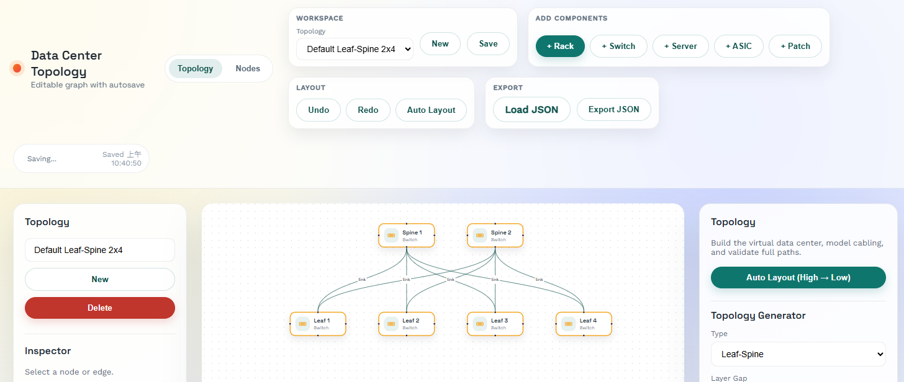

# Data Center Topology Viewer



Editable data center topology viewer with a React Flow frontend and FastAPI backend (front/back separated).

This application was created with CodeX.

## Status

### Completed

- Editable nodes and edges (drag, connect, relabel, delete)
- Autosave to backend (SQLite) with manual save
- Multi-topology CRUD
- Auto layout (tiered, top-down with numeric tiers)
- Tier 1 topology generators: Leaf-Spine, Fat-Tree, 3-Tier
- Tier 2 topology generators: Expanded Clos, Core-and-Pod
- Tier 3 topology generators: 2D/3D Torus, Dragonfly, Butterfly, Mesh/Ring/Star
- Topology metadata persisted (type + params)

### Not Yet Implemented

- Validation rules per topology

## Setup

### Docker (frontend + backend)

```bash
docker compose up --build
```

### Backend

```bash
cd backend
python -m venv .venv
source .venv/bin/activate
pip install -r requirements.txt
uvicorn app.main:app --reload --host 0.0.0.0 --port 8000
```

Local backend runs store SQLite data in `backend/data/topology.db` by default.

### Frontend

```bash
cd frontend
npm install
npm run dev -- --host 0.0.0.0
```

Open `http://localhost:5173`.

### Proxy Target (Docker)

When running via docker compose, the frontend proxy target is set to `http://backend:8000`.
For local dev, it defaults to `http://127.0.0.1:8000`.

## API

Full API usage guide: [docs/API.md](/mnt/d/CodeX/topology_view/docs/API.md)

- `GET /api/topologies` list topologies
- `POST /api/topologies` create topology
- `GET /api/topologies/{id}` get topology
- `PUT /api/topologies/{id}` update topology
- `DELETE /api/topologies/{id}` delete topology
- `POST /api/topologies/{id}/generate` generate Tier 1 topologies

Legacy single-topology endpoints (still supported):

- `GET /api/topology`
- `PUT /api/topology`

### Agent-Friendly Graph APIs

These endpoints let an AI agent modify the topology without replacing the whole JSON document each time.

- `GET /api/meta` list supported node kinds, topology types, arrange modes, handles, and patch panel limits
- `POST /api/topologies/{id}/nodes` add one node
- `POST /api/topologies/{id}/nodes/batch` batch-add nodes, optionally auto-connecting them to the nearest lower tier
- `PATCH /api/topologies/{id}/nodes/{node_id}` update one node
- `DELETE /api/topologies/{id}/nodes/{node_id}` delete one node and its connected edges
- `POST /api/topologies/{id}/edges` add one edge
- `PATCH /api/topologies/{id}/edges/{edge_id}` update one edge
- `DELETE /api/topologies/{id}/edges/{edge_id}` delete one edge
- `POST /api/topologies/{id}/layout` apply backend auto-layout
- `POST /api/topologies/{id}/arrange` align or distribute a set of node IDs

Example requests:

```bash
curl -X POST http://127.0.0.1:8000/api/topologies/1/nodes \
  -H 'Content-Type: application/json' \
  -d '{"kind":"patch","tier":2,"splitCount":512}'

curl -X POST http://127.0.0.1:8000/api/topologies/1/edges \
  -H 'Content-Type: application/json' \
  -d '{"source":"node-a","target":"node-b","label":"uplink"}'

curl -X POST http://127.0.0.1:8000/api/topologies/1/layout \
  -H 'Content-Type: application/json' \
  -d '{"end_gap":true}'
```

## Notes

- Data stored in `backend/data/topology.db` (SQLite) for local dev and Docker Compose.
- If you have an existing DB from older versions, delete `backend/data/topology.db` to pick up new columns.
